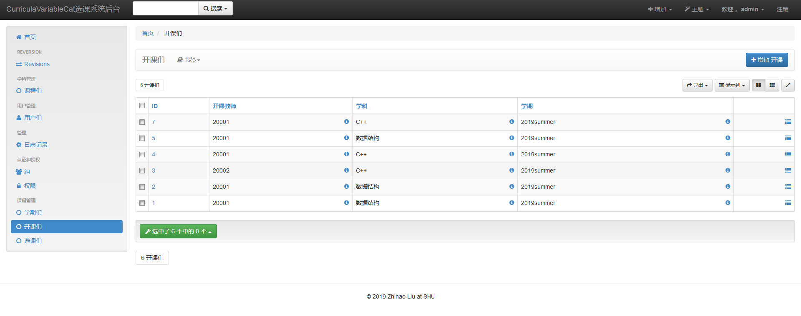

# CurriculaVariableCat_Back
超简洁选课系统(服务端)，Django REST framework。


## 前端项目地址
[CurriculaVariableCat_Front](https://github.com/LauZyHou/CurriculaVariableCat_Front)

## 后端运行展示


## 项目构建
创建虚拟环境：
```
conda env create -f env.yml
```
虚拟环境将被安装到E:/Envs/DRF下。其中XAdmin无法直接获取，使用pip安装：
```
conda activate DRF
pip install https://codeload.github.com/sshwsfc/xadmin/zip/django2
```
在本地MySQL数据库中创建该项目使用的Scheme：
```
Default collation: utf8_general_ci
Default characterset: utf8
```
然后修改CurriculaVariableCat.settings配置文件下的数据库配置。

从Model建立数据库表，使用Task指令：
```
python manage.py makemigrations
python manage.py migrate
```
提取XAdmin所使用静态文件，使用Task指令：
```
python manage.py collectstatic
```
创建超级用户，使用Task指令：
```
python manage.py createsuperuser
```
> 若使用PyCharm，可以在Tools->run manage.py Task调出Task指令的Terminal，使用时无需再输入`python manage.py`。

## 数据库中的操作
### 定义触发器
开课时,将课程号和课程名自动写入开课表：
```mysql
drop trigger if exists trigger_course;
delimiter $$
create trigger trigger_course
before insert on course_course for each row
begin
    declare sid varchar(8);
    declare sname varchar(20);
    select logic_id into sid from subject_subject where id=new.subject_id;
    select name into sname from subject_subject where id=new.subject_id;
    set new.sub_logic_id=sid, new.sub_name=sname;
end;
$$
```
更新开课表时，将课程号和课程名自动更新进开课表：
```mysql
drop trigger if exists trigger_course2;
delimiter $$
create trigger trigger_course2
before update on course_course for each row
begin
    declare sid varchar(8);
    declare sname varchar(20);
    select logic_id into sid from subject_subject where id=new.subject_id;
    select name into sname from subject_subject where id=new.subject_id;
    set new.sub_logic_id=sid, new.sub_name=sname;
end;
$$
```
## 项目运行
直接在PyCharm中运行，添加Environment Variables：
```
DJANGO_SETTINGS_MODULE=CurriculaVariableCat.settings
PYTHONUNBUFFERED=1
```
